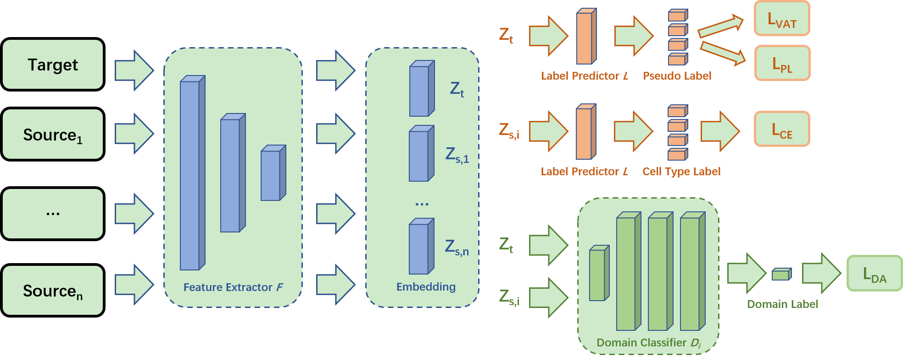

# 一种基于多源域适应的单细胞智能分类方法
### 魏琢艺<sup>1,2</sup> ，罗迈<sup>1,2</sup> ，李文兵<sup>1,2</sup>， 曾远松<sup>1,2</sup> ，杨跃东<sup>1,2</sup>


 (empty)
       





# Usage
```bash
$ python main_pseudo_dann.py --lr 0.5 --epoch 50 --batch_size 64 --name pbmc_ding --cuda 0
```
Note: the detailed parameters instructions please see [MSASC_Train](https://github.com/biomed-AI/MSASC/blob/main/main_pseudo_dann.py)


## System environment
Required package:
- PyTorch >= 1.10
- scanpy >= 1.8
- python >=3.7
- tensorboard
- anndata == 0.7.6

# Datasets

 -  PBMC
 -  pancreas
